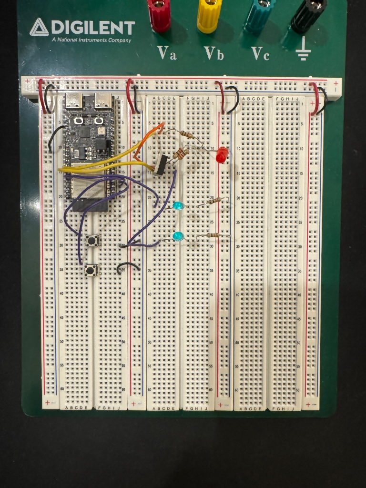
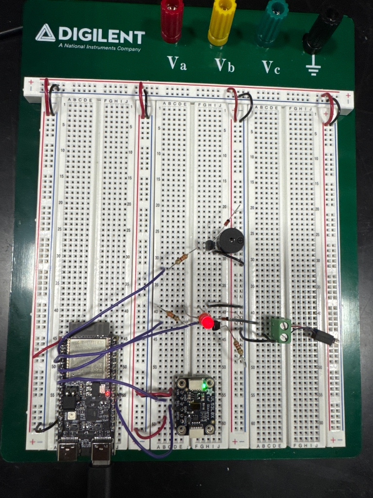
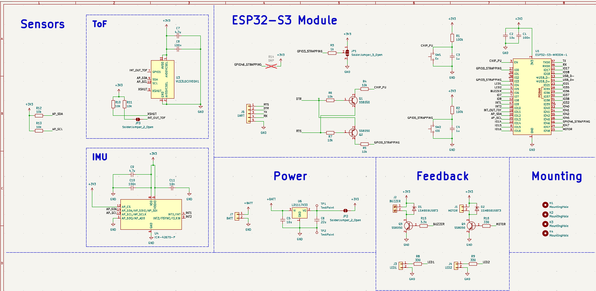
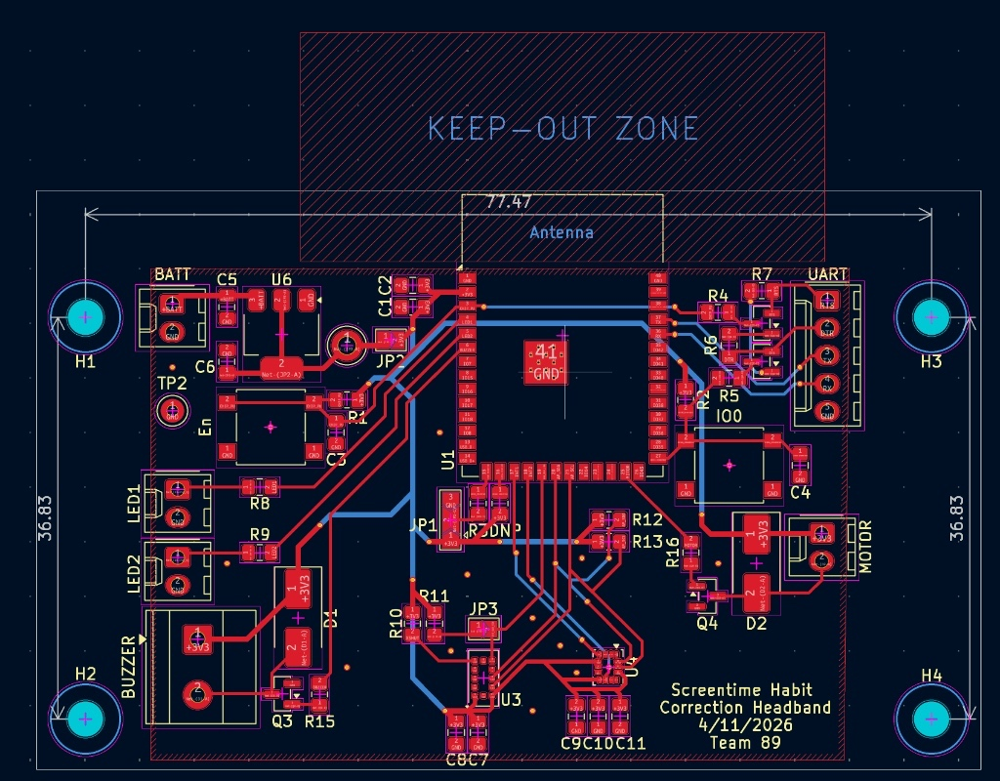
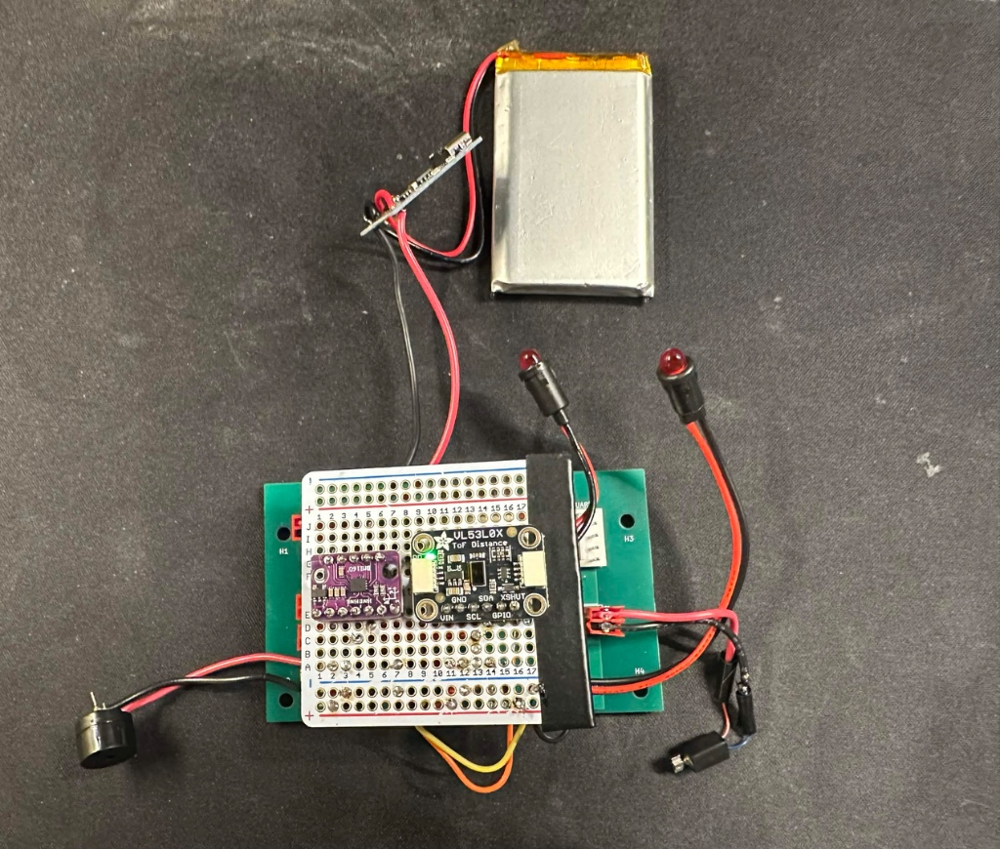
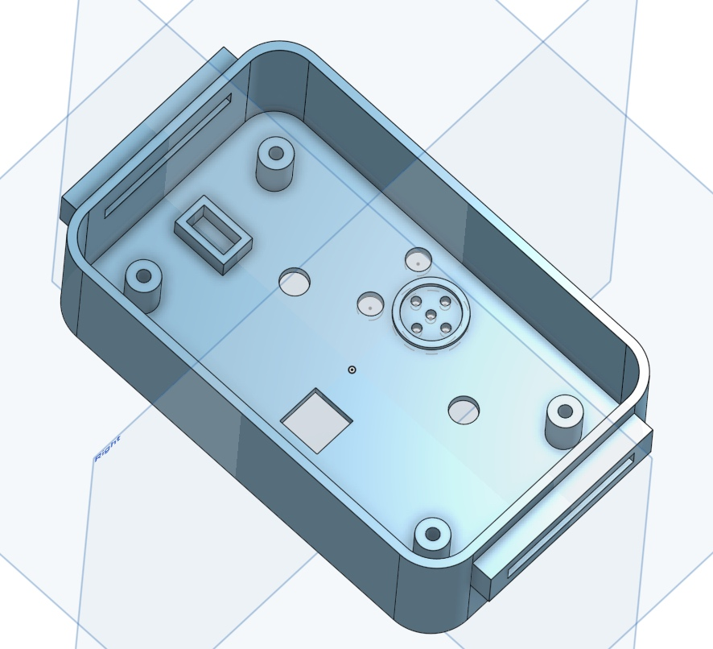
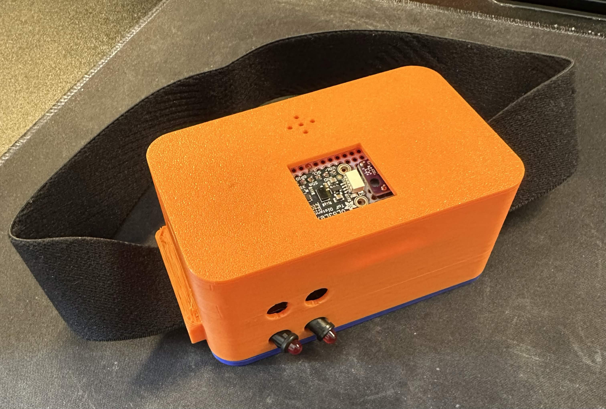

# ece445-notebook
## Date: 2026-02-25

### Objective
Research wireless communication protocols (BLE vs. Wi-Fi) for the ESP32 and initialize the ESP-IDF development environment.

### Record
* Installed the Espressif IoT Development Framework (ESP-IDF) and FreeRTOS toolchain on my local machine to support the C++ firmware development.
* Began researching Bluetooth Low Energy (BLE) GATT profiles for transmitting sensor telemetry to the companion app.
* **Debugging Note:** Discovered a major architectural hurdle with our App team's stack. Standard React Native (via Expo Go) does not support native BLE bridging libraries out-of-the-box without ejecting the app and doing custom iOS/Android builds. 
* **Design Decision:** Proposing a pivot to establishing a local Wi-Fi Access Point (AP) and an HTTP server on the ESP32 instead of BLE. This will allow the React Native app to request data using standard JSON `fetch()` calls, entirely bypassing the Expo native-code limitations.

---

## Date: 2026-03-04

### Objective
Set up the initial breadboard hardware to mock sensor inputs and feedback mechanisms for the upcoming Breadboard Demo.

### Record
* Because the I2C sensors (VL53L0X and ICM-42670-P) and feedback components (ERM motor, buzzer) have not yet arrived, I designed a mocked hardware environment to test our firmware logic.
* Wired tactile push buttons to the ESP32 GPIO pins to simulate the ToF and IMU threshold triggers (simulating a "bad posture" event).

* Wired standard LEDs with current-limiting resistors to serve as visual stand-ins for the progressive feedback system.
* The custom power subsystem is not yet built, so the entire breadboard assembly is being powered directly via a USB-C cable connected to the ESP32 development board.

---

## Date: 2026-03-10

### Objective
Program the non-blocking state machine logic for the 3-second delay and successfully present the Breadboard Demo.

### Record
* Wrote the core C++ firmware using `esp_timer_get_time()` to implement a non-blocking 3.0-second delay without using `vTaskDelay()`.
* Configured the logic so that pressing and holding a mock "sensor" button logs an anchor timestamp. If the button is released before 3 seconds (posture corrected), the timer instantly resets. If held for >= 3 seconds, the ESP32 successfully drives the "feedback" LED pin HIGH.
* Successfully presented the Breadboard Demo to the TAs. Proved that the core timing architecture functions reliably and can track sustained events without freezing the microcontroller's main loop.

---
## Date: 2026-03-18

### Objective
Configure ESP-IDF I2C drivers and LEDC PWM timers in preparation for physical hardware integration.

### Record
* Initialized the I2C master driver on GPIO 8 (SCL) and GPIO 9 (SDA) operating at 100 kHz to prepare for the ToF sensor.
* Configured the ESP32 `ledc` peripheral for the progressive feedback system. Assigned Timer 0 to the vibration motor and LED at 1000 Hz, and Timer 1 to the piezoelectric buzzer at 2000 Hz, both utilizing 13-bit resolution.
* Collaborated with Zhiyuan on the software architecture to connect my sensor logic to his Wi-Fi HTTP server. We established a shared `newSessionReady` boolean flag and a `lastDistanceTime` variable so his HTTP handlers can asynchronously read my state machine's events without blocking the main loop.

---

## Date: 2026-04-02

### Objective
Integrate the physical VL53L0X Time-of-Flight sensor on the breadboard and develop the custom I2C read sequences.

### Record
* The physical VL53L0X breakout board arrived. Wired it to the ESP32 and utilized the XSHUT pin (GPIO 2) to manually reset the sensor's boot state.

* Wrote custom `read_reg16()` and `write_reg()` I2C wrapper functions. 
* Developed `vl53l0x_simple_init()` to verify the device ID (0xEE) and extract the required NVM stop variable from register 0x91. 
* **Debugging Note:** The sensor occasionally returned erratic 0mm readings due to complete IR absorption. Implemented software clamping: if `distance_mm > 2000` or `== 0`, it is forcefully set to a safe default of `1200` to prevent false posture alarms.

---

## Date: 2026-04-07

### Objective
Finalize the dynamic PWM state machine and present the Progress Demo.

### Record
* Completed the non-blocking state machine using `esp_timer_get_time()`. If `distance_mm < 300`, the system successfully logs `distanceStartTime` and scales the 13-bit PWM duty cycle linearly up to a 50% cap.
* Verified that if the 3-second window expires, the system triggers the HTTP JSON payload via the `newSessionReady` flag.
* **Demo Results & Debugging Note:** The Progress Demo was unsuccessful. During the live presentation, the VL53L0X sensor locked up and continuously output a single, frozen distance value, completely halting the state machine's ability to track movement. 
* **Hypothesis & Next Steps:** I suspect the breadboard wiring caused a transient voltage drop that crashed the sensor's internal state, or the I2C bus locked up. Moving forward, I need to implement an automatic hardware reset in the main loop. I plan to use the sensor's XSHUT pin to physically power-cycle the VL53L0X if it becomes unresponsive.

---

## Date: 2026-04-15

### Objective
Migrate firmware to the new ESP32-S3 custom PCB and implement IMU pitch math.

### Record
* My groupmates completed soldering the custom ESP32-S3 PCB. I updated the ESP-IDF hardware definitions in the firmware to match the new schematic: I2C SCL is now on GPIO 13, SDA on GPIO 12, and the vibration motor moved to GPIO 48.

* Wrote the I2C drivers to initialize the IMU (ICM-42670-P) and implemented the trigonometric pitch calculation: `pitch = atan2(-ax, sqrt(ay * ay + az * az)) * 180.0 / M_PI;`.
* **Hardware Note:** My groupmates successfully implemented the hardware fix for the VL53L0X lock-up issue we saw at the Progress Demo, wiring the XSHUT pin to allow hard resets.

---

## Date: 2026-04-22

### Objective
Present the Mock Demo and debug physical hardware integration issues.

### Record
* Presented the Mock Demo to the TA. At this stage, we only had the custom PCB; none of the feedback components (motor, buzzer, LEDs) were physically connected yet. 
* **Critical Hardware Bug:** During testing, we discovered that the VL53L0X ToF sensor was fried during the PCB soldering process. It is no longer returning valid distance data.
* **Pivot Strategy:** Instead of attempting to desolder and replace the tiny surface-mount sensor on the main PCB, we decided to mount a secondary protoboard carrying intact breakout boards for the sensors, which we will wire back to the main PCB.

---

## Date: 2026-04-23

### Objective
Re-architect the firmware state machine and map the onboard calibration button.

### Record
* Split the warning logic into two independent trackers: `Distance State Machine` and `Posture State Machine`. Refactored the HTTP server to `/distance` and `/posture` so the app can poll them independently.
* Added combination logic to seamlessly merge the PWM outputs: `motor_percent = (dist_motor_percent > post_motor_percent) ? dist_motor_percent : post_motor_percent;`.
* Mapped the `recalibrate_sensors()` function (which resets the IMU zero-angle offset and restarts the ToF sensor via XSHUT) to the existing button integrated onto our custom PCB.

---

## Date: 2026-04-24

### Objective
Design the initial 3D unibody enclosure for the headband.

### Record
* Modeled the first iteration (V1) of the 3D unibody enclosure in CAD. 
* Designed the internal layout based on the original PCB dimensions, including a small window for the ToF sensor and a centered mounting point for the elastic headband strap.

* Exported the STL files and sent them to the 3D printer for overnight fabrication.

---

## Date: 2026-04-25

### Objective
Evaluate the V1 3D print and identify mechanical interference issues.

### Record
* Collected the V1 3D print from the lab. Attempted to fit the electronics (PCB and battery) into the enclosure.
* **Problem:** The enclosure is too small. Because we pivoted to using a protoboard with breakout boards for the sensors (due to the fried SMD sensors on the main PCB), the internal volume required is significantly larger than the original CAD model accounted for.
* Observed that the ToF sensor window was also slightly misaligned with the breakout board's laser orientation.

---

## Date: 2026-04-26

### Objective
Iterate and redesign the 3D enclosure (CAD V2) to accommodate the hardware pivot.

### Record
* Redesigned the enclosure (V2) to expand the internal cavity, specifically adding depth to allow for the stacked protoboard and the 3.7V LiPo battery.
* Repositioned the external port alignments for the USB-C charging port and the buzzer acoustic grill. 
* Significantly expanded the ToF sensor window to ensure the laser had an unobstructed field of view despite the bulky breakout board mounting. Sent V2 to the printer.

---

## Date: 2026-04-27

### Objective
Conduct physical design verification testing on the final hardware prior to the Final Demo.

### Record
* Performed physical accuracy testing on the VL53L0X Time-of-Flight sensor. Set up a test station using a ruler to place the headband at exact, known distances from a monitor (e.g., 10, 12, 15, and 20 inches) and recorded the sensor's serial output to verify our ±0.5 inch accuracy requirement.
* Performed physical angle verification on the ICM-42670-P IMU. Used a protractor to physically tilt the headband to specific angles and cross-referenced the true physical angle against the calculated pitch output from the `atan2` firmware function.

---

## Date: 2026-04-28

### Objective
Finalize system assembly and present the Final Demo.

### Record
* Assembled the main PCB, the secondary sensor protoboard, the battery, and all feedback components into the V2 3D-printed enclosure.

* Verified that the onboard calibration button successfully resets the posture baseline when worn on the head, and confirmed that both independent state machines trigger the progressive PWM motor correctly.
* Successfully presented the Final Demo. The headband accurately monitored posture and distance simultaneously without dropping the local Wi-Fi connection.

---
